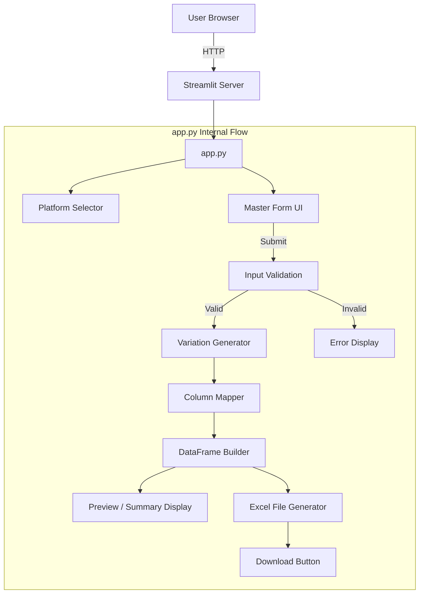

# Design Document: Bulk Listing Generator

## Overview

The Bulk Listing Generator is a local Python Streamlit web application that enables e-commerce sellers to generate platform-specific bulk listing Excel files (.xlsx) for Meesho and Flipkart. The application provides a single master input form, automatically generates all Color × Size variation combinations with unique SKUs and style codes, maps data to platform-specific column headers, and outputs a downloadable Excel file ready for marketplace upload.

### Key Design Decisions

1. **Single-file architecture (app.py)**: Per Requirement 7, all application logic resides in one file for maximum portability. Internal separation is achieved through well-defined functions rather than modules.
2. **Streamlit framework**: Provides rapid UI development with built-in form handling, session state, and download capabilities — no frontend/backend separation needed.
3. **Pandas + openpyxl for Excel generation**: Pandas DataFrames handle tabular data manipulation naturally; openpyxl is the engine for .xlsx serialization.
4. **Stateless generation**: Each form submission produces a fresh result. No database or persistent state is required.

## Architecture



### Data Flow

1. User selects platform and fills the master form
2. On submit, input validation runs — errors halt the pipeline
3. Colors and sizes are parsed, trimmed, deduplicated
4. Variation generator produces Color × Size cartesian product
5. SKUs and style codes are generated with collision-handling
6. Column mapper translates internal field names to platform-specific headers
7. DataFrame is built with platform headers
8. Preview table and summary are rendered
9. Excel file is generated in-memory as bytes (BytesIO)
10. Download button is presented with the generated file

## Components and Interfaces

### 1. Platform Configuration (`PLATFORM_CONFIGS`)

A dictionary constant defining per-platform column headers and field mappings.

```python
PLATFORM_CONFIGS = {
    "Meesho": {
        "headers": ['Style Code', 'SKU ID', 'Product Title', 'Price', 
                    'GST %', 'Fabric', 'Description', 'Color', 'Size'],
        "field_map": {
            "style_code": "Style Code",
            "sku": "SKU ID",
            "product_title": "Product Title",
            "price": "Price",
            "gst": "GST %",
            "fabric": "Fabric",
            "description": "Description",
            "color": "Color",
            "size": "Size"
        }
    },
    "Flipkart": {
        "headers": ['Group ID / Style Code', 'Seller SKU ID', 'Product Name', 
                    'Selling Price', 'GST Rate', 'Material', 'Key Features', 'Color', 'Size'],
        "field_map": {
            "style_code": "Group ID / Style Code",
            "sku": "Seller SKU ID",
            "product_title": "Product Name",
            "price": "Selling Price",
            "gst": "GST Rate",
            "fabric": "Material",
            "description": "Key Features",
            "color": "Color",
            "size": "Size"
        }
    }
}
```

### 2. Input Parsing Functions

```python
def parse_comma_separated(raw: str) -> list[str]:
    """Parse comma-separated input, trim whitespace, remove empties, deduplicate preserving order."""
    ...

def validate_inputs(form_data: dict) -> list[str]:
    """Validate all form fields. Returns list of error messages (empty = valid)."""
    ...
```

### 3. Variation Generation Functions

```python
def generate_color_codes(base_style_code: str, colors: list[str]) -> dict[str, str]:
    """Generate Color_Style_Code for each color with collision handling.
    Returns mapping: color_name -> Color_Style_Code"""
    ...

def generate_variations(form_data: dict, color_codes: dict[str, str]) -> list[dict]:
    """Generate all Color × Size variation rows as list of dicts with internal field names."""
    ...
```

### 4. DataFrame Builder

```python
def build_dataframe(variations: list[dict], platform: str) -> pd.DataFrame:
    """Build a DataFrame with platform-specific column headers from variation rows."""
    ...
```

### 5. Excel Generation

```python
def generate_excel_bytes(df: pd.DataFrame) -> bytes:
    """Serialize DataFrame to .xlsx bytes using openpyxl engine via BytesIO."""
    ...
```

### 6. Filename Generator

```python
def generate_filename(platform: str, base_style_code: str) -> str:
    """Generate filename: [Platform]_[sanitized_base_style_code]_bulk.xlsx"""
    ...
```

### 7. UI Layer (Streamlit main)

The `main()` function orchestrates:
- Platform selector (`st.selectbox`)
- Master form (`st.form`)
- Validation and error display (`st.error`)
- Generation pipeline call
- Summary display (`st.metric` or `st.write`)
- Preview table (`st.dataframe`)
- Download button (`st.download_button`)

## Data Models

### Form Data (Internal Representation)

```python
@dataclass
class FormData:
    brand_name: str          # max 100 chars
    product_category: str    # max 100 chars
    price: float             # 1 to 9,999,999, up to 2 decimal places
    gst_percent: float       # one of [0, 3, 5, 12, 18, 28]
    fabric_material: str     # max 100 chars
    description: str         # max 2000 chars
    base_style_code: str     # max 50 chars
    colors: list[str]        # parsed, trimmed, deduplicated; max 50 values
    sizes: list[str]         # parsed, trimmed, deduplicated; max 50 values
    platform: str            # "Meesho" or "Flipkart"
```

### Variation Row (Internal Representation)

```python
@dataclass
class VariationRow:
    style_code: str       # Color_Style_Code
    sku: str              # Color_Style_Code + "-" + SIZE
    product_title: str    # "[Brand] [Category] - [Color] - [Size]"
    price: float
    gst: float
    fabric: str
    description: str
    color: str
    size: str
```

### Color Code Generation Logic

```
Input: base_style_code = "TSHIRT-COTTON", colors = ["Black", "Blue", "Blanc"]

Step 1: Abbreviate each color to first 3 chars uppercase
  "Black" → "BLA"
  "Blue"  → "BLU"  
  "Blanc" → "BLA"  (collision with "Black")

Step 2: Resolve collisions with numeric suffix starting from 2
  "Black" → "BLA"   (first occurrence, no suffix)
  "Blanc" → "BLA2"  (second occurrence of "BLA")

Step 3: Combine with base style code
  "Black" → "TSHIRT-COTTON-BLA"
  "Blue"  → "TSHIRT-COTTON-BLU"
  "Blanc" → "TSHIRT-COTTON-BLA2"
```

### SKU Format

```
[Color_Style_Code]-[SIZE_UPPERCASE]
Example: "TSHIRT-COTTON-BLA-M", "TSHIRT-COTTON-BLU-XL"
```


## Correctness Properties

*A property is a characteristic or behavior that should hold true across all valid executions of a system — essentially, a formal statement about what the system should do. Properties serve as the bridge between human-readable specifications and machine-verifiable correctness guarantees.*

### Property 1: Comma-separated parsing produces clean, unique output

*For any* input string, the `parse_comma_separated` function SHALL return a list where: (a) no element is empty or whitespace-only, (b) no element has leading or trailing whitespace, and (c) no two elements are equal (uniqueness preserved with first-occurrence order).

**Validates: Requirements 2.3, 2.4, 2.5**

### Property 2: Variation generation produces correct cartesian product

*For any* list of N unique colors and M unique sizes, the variation generator SHALL produce exactly N × M rows, ordered such that all sizes for color[0] appear before all sizes for color[1], and within each color group sizes appear in their original input order.

**Validates: Requirements 3.1, 3.4**

### Property 3: Color code generation produces unique, correctly formatted codes

*For any* base style code and list of colors (each with at least 1 character), the generated Color_Style_Codes SHALL all be unique, and each SHALL match the pattern `[Base_Style_Code]-[A-Z0-9]{3,}` where the alphabetic prefix is the first 3 characters (or fewer if the color is shorter) of the color name uppercased.

**Validates: Requirements 3.2, 3.5**

### Property 4: SKU generation produces unique identifiers

*For any* set of unique colors and unique sizes, all generated SKUs SHALL be unique and each SHALL match the format `[Color_Style_Code]-[SIZE_UPPERCASE]`.

**Validates: Requirements 3.3**

### Property 5: Product title follows concatenation pattern

*For any* brand name, product category, color, and size (all non-empty strings), the generated product title SHALL equal exactly `"{brand_name} {product_category} - {color} - {size}"`.

**Validates: Requirements 4.4**

### Property 6: Platform selection determines output columns

*For any* valid form data and selected platform (either "Meesho" or "Flipkart"), the resulting DataFrame SHALL have columns that exactly match the platform's defined header list in the correct order, and all size variations of the same color SHALL share the same value in the style code column.

**Validates: Requirements 1.3, 4.5**

### Property 7: Filename sanitization follows pattern

*For any* platform name and base style code string, the generated filename SHALL match the pattern `[Platform]_[sanitized_code]_bulk.xlsx` where sanitized_code contains only alphanumeric characters, hyphens, and underscores (all spaces and special characters replaced with hyphens).

**Validates: Requirements 6.2**

### Property 8: Invalid inputs are rejected by validation

*For any* form data where at least one of the following holds — (a) a required text field is blank/whitespace-only, (b) price is non-positive, (c) colors or sizes parse to an empty list, (d) GST is negative — the validation function SHALL return a non-empty list of error messages and generation SHALL NOT proceed.

**Validates: Requirements 8.1, 8.2, 8.3, 8.4**

## Error Handling

### Validation Errors

| Condition | Error Message | Behavior |
|-----------|--------------|----------|
| Required text field blank/whitespace | "Please fill in: {field_name}" | Block generation, show all errors |
| Price non-positive or non-numeric | "Price must be a positive number" | Block generation |
| Colors/Sizes empty after parsing | "At least one color and one size are required" | Block generation |
| GST negative or non-numeric | "GST % must be a number equal to or greater than 0" | Block generation |

### Runtime Errors

| Condition | Handling |
|-----------|----------|
| Excel generation failure (e.g., memory, I/O) | Catch exception, display `st.error("File generation was unsuccessful. Please try again.")`, hide download button |
| Unexpected exception in variation generation | Catch at top level, display generic error, log traceback to console |

### Error Display Strategy

- All validation errors are collected and displayed together using `st.error()` for each message
- Errors appear below the form, above any preview/download area
- No partial output is shown when errors exist — generation is all-or-nothing

## Testing Strategy

### Testing Framework

- **Unit/Example tests**: `pytest` for standard unit tests
- **Property-based tests**: `hypothesis` (Python PBT library) with minimum 100 examples per property
- **Test file**: `test_app.py` in the project root

### Property-Based Tests (via Hypothesis)

Each correctness property maps to one property-based test:

| Property | Test Function | Key Generators |
|----------|---------------|----------------|
| P1: Comma parsing | `test_parse_comma_separated_clean_output` | `st.text()` with commas, whitespace |
| P2: Cartesian product | `test_variation_count_and_order` | `st.lists(st.text(min_size=1))` for colors/sizes |
| P3: Color code uniqueness | `test_color_codes_unique_and_formatted` | `st.text(min_size=1)` lists |
| P4: SKU uniqueness | `test_skus_unique_and_formatted` | Colors + sizes lists |
| P5: Product title format | `test_product_title_concatenation` | `st.text(min_size=1)` for each component |
| P6: Platform columns | `test_platform_columns_match_config` | Valid form data + `st.sampled_from(["Meesho", "Flipkart"])` |
| P7: Filename sanitization | `test_filename_sanitization_pattern` | `st.text()` for base style code |
| P8: Validation rejects invalid | `test_invalid_inputs_rejected` | Generators for each invalid condition |

**Configuration**: Each property test uses `@settings(max_examples=100)` minimum.

**Tag format**: Each test includes a docstring: `"""Feature: bulk-listing-generator, Property {N}: {title}"""`

### Example-Based Unit Tests

| Requirement | Test | Purpose |
|-------------|------|---------|
| 4.1, 4.2 | `test_meesho_headers_exact`, `test_flipkart_headers_exact` | Verify exact header lists |
| 3.2 | `test_color_code_known_examples` | "Black"→"BLA", "Light Blue"→"LIG" |
| 3.5 | `test_color_code_collision_example` | "Black","Blanc"→"BLA","BLA2" |
| 6.2 | `test_filename_known_examples` | Known inputs → expected filenames |

### Integration Tests

| Requirement | Test | Purpose |
|-------------|------|---------|
| 6.3 | `test_excel_file_readable` | Generate file, open with openpyxl, verify content |
| 7.5 | `test_app_imports_cleanly` | Import app.py without errors |

### Test Execution

```bash
# Run all tests
pytest test_app.py -v

# Run only property tests
pytest test_app.py -v -k "property"

# Run with hypothesis verbose output
pytest test_app.py -v --hypothesis-show-statistics
```
